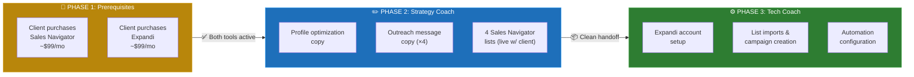
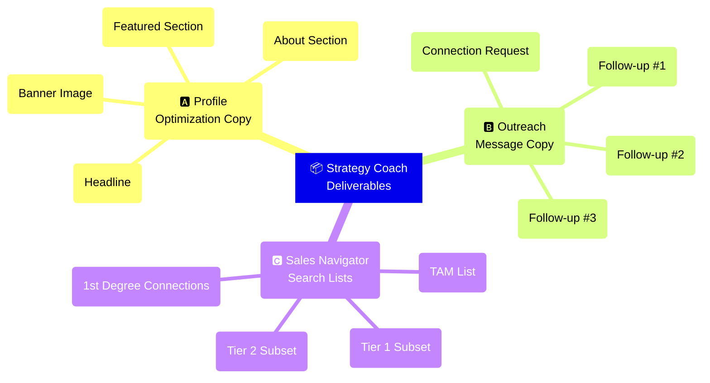
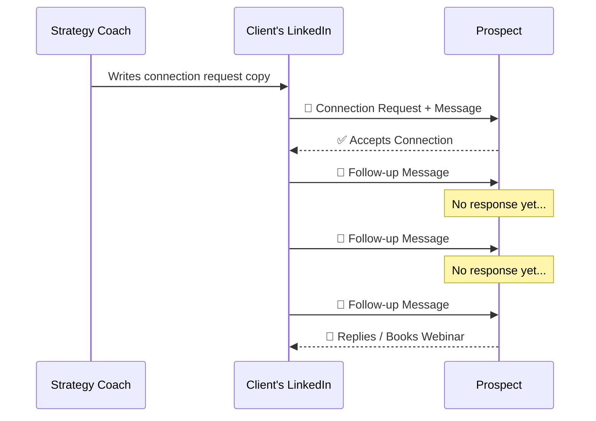

# 🔗 LinkedIn Promotion Strategy

### Standard Operating Procedure for Strategy Coaches

| | |
|---|---|
| 📅 **Last Updated** | February 27, 2026 |
| 👥 **Audience** | Strategy coaches new to the LinkedIn promotion workflow |
| 📌 **Version** | 1.0 |

> [!IMPORTANT]
> This is a **continuous improvement strategy**, not a prerequisite. The client's webinar funnel should already be live before starting LinkedIn promotion.

---

## 🧭 Overview

The LinkedIn promotion strategy uses **LinkedIn Sales Navigator** + **Expandi** (an automation tool) to send targeted connection requests and follow-up messages that drive prospects to the client's webinar.

There are **three phases** with a clear handoff between strategy coach and tech coach:




### 💰 Cost to Client

| Tool | Monthly Cost | Purpose |
|:-----|:------------:|:--------|
| 🔍 LinkedIn Sales Navigator | **~$99/month** | Advanced search & lead lists |
| 🤖 Expandi | **~$99/month** | Automated outreach & follow-ups |
| | **~$198/month total** | |

---

## 🛒 Phase 1 — Prerequisites

> *Before any coaching calls*

The client needs **both tools purchased and active** before you begin Phase 2.

### Client To-Do List

- [ ] Purchase LinkedIn Sales Navigator (~$99/month)
- [ ] Purchase Expandi (~$99/month)

### 📋 How to Guide the Client

| Scenario | What to Do |
|:---------|:-----------|
| Client is self-sufficient | Share the QS video walkthrough for purchasing Sales Navigator. They handle it independently. |
| Client needs hand-holding | Schedule a short call with the **tech coach** to walk them through signup. |

> [!CAUTION]
> **Do NOT proceed to Phase 2** until both tools are active. Starting without them creates unnecessary back-and-forth and delays the entire process.

---

## ✏️ Phase 2 — Strategy Coach Work

> *Copy + Targeting — This is YOUR main responsibility*

You need to deliver **three categories of work** before handing off to the tech coach:



---

### 🅰️ LinkedIn Profile Optimization Copy

The client's LinkedIn profile needs to be **rewritten to align with their webinar and offer**. Prepare the following:

| # | Deliverable | Details |
|:-:|:------------|:--------|
| 1 | **Headline** | Rewrite to align with the webinar/offer — *not* their job title |
| 2 | **About Section** | Describe who they are, what they do, and promote the webinar. Everything should point toward the webinar as the CTA |
| 3 | **Banner Image** | Tech coach provides a Canva template → client/VA creates the banner → should include a webinar invitation |
| 4 | **Featured Section** | Update with a direct link to the webinar registration/event page |

> [!TIP]
> The copywriter (**James or Mike**) can write the headline and About section if needed. Coordinate with them **early** so this doesn't become a bottleneck.

---

### 🅱️ Outreach Message Copy

Write **four messages total**. All messages must be aligned to the client's specific offer, niche, and business:

| # | Message Type | Purpose |
|:-:|:-------------|:--------|
| 1 | 🤝 **Connection Request** | The opening message sent with the connection request |
| 2 | 📩 **Follow-up #1** | Sent after connection is accepted |
| 3 | 📩 **Follow-up #2** | Second follow-up nudge |
| 4 | 📩 **Follow-up #3** | Third and final follow-up |



> [!WARNING]
> **Keep messages short and conversational.** LinkedIn is not email. Long pitches get ignored. Think text message, not sales letter.

---

### 🅲 Sales Navigator Search Lists

> *Done LIVE with the Client — Do not skip the live session*

| | |
|:--|:--|
| **Why live?** | Clients rarely remember their Apollo targeting filters. Building the search together prevents errors and avoids back-and-forth later. |
| **Where to do it?** | A short 1-on-1 call or during group coaching works fine. |
| **What to do?** | Recreate the same targeting filters from Apollo inside Sales Navigator — same job titles, industries, company sizes, and geography. |

You need to produce **4 saved lists:**


| # | List Name | Description | Target Size |
|:-:|:----------|:------------|:-----------:|
| 1 | **TAM (Total Addressable Market)** | Full search with all core filters applied | Thousands |
| 2 | **Tier 1 Subset** | Narrower slice of TAM — narrow by geography or headcount | 1,000–2,500 |
| 3 | **Tier 2 Subset** | Different slice of TAM — use different filters than Tier 1 | 1,000–2,500 |
| 4 | **1st Degree Connections** | Filter TAM for people already connected to the client | Varies |

> [!IMPORTANT]
> **Why 1,000–2,500 per list?** Expandi cannot import lists larger than ~2,500 leads. The strategy coach breaks the TAM into manageable chunks by adding filters (states, headcount ranges, etc.) to narrow each subset.

**Example of Chunking:**

```
TAM = 8,000 marketing directors in the US
├── Tier 1  → CA, TX, NY, FL          = 1,800 leads ✅
├── Tier 2  → Remaining states         = 2,100 leads ✅
└── 1st Deg → Already connected        = varies       ✅
```

---

## ⚙️ Phase 3 — Tech Coach Handoff

Once you have completed everything in Phase 2, **hand off to the tech coach**. They will handle:

- [ ] Expandi account setup (if the client hasn't done this yet)
- [ ] Import all 4 Sales Navigator lists into Expandi
- [ ] Create campaigns using the outreach copy you wrote
- [ ] Set up automated connection request sequences
- [ ] Set up automated follow-up message sequences
- [ ] Configure daily sending limits and campaign settings

### 📦 What to Include in Your Handoff

> Send the tech coach **all four items**. No ambiguity, no missing pieces.

| # | Handoff Item | Details |
|:-:|:-------------|:--------|
| 1 | 📝 **Profile Copy** | Headline, About section, Featured section link |
| 2 | 💬 **Outreach Messages** | Connection request + 3 follow-ups (all 4 messages) |
| 3 | ✅ **List Confirmation** | Confirm that the 4 Sales Navigator lists are saved in the client's account |
| 4 | 🏷️ **List Names** | The exact names of the 4 saved lists so the tech coach can find them |

> [!CAUTION]
> **The cleaner your handoff, the faster the tech coach can set everything up.** Missing copy or unnamed lists cause delays that reflect poorly on the whole team.

---

## ⚠️ Common Pitfalls

| # | 🚩 Problem | ✅ How to Avoid It |
|:-:|:-----------|:-------------------|
| 1 | Client hasn't purchased Sales Navigator or Expandi | Confirm both are active **BEFORE** starting Phase 2 |
| 2 | Client can't remember their Apollo filters | Always build Sales Navigator lists **live with the client** — never ask them to do it alone |
| 3 | Lists are too large for Expandi | Keep each list between **1,000 and 2,500 leads**. Break the TAM into smaller segments using additional filters |
| 4 | Profile copy doesn't mention the webinar | The entire profile should funnel toward the webinar. Review every section for alignment |
| 5 | Handoff to tech coach is incomplete | Use the **handoff checklist** above. Missing copy or unnamed lists cause delays |
| 6 | Client thinks this replaces other lead gen | Set expectations: LinkedIn is an **additional channel**, not a replacement. Lead volume is typically lower than other channels |

---

## ✅ Quick Reference Checklist

### 🟡 Before You Start
- [ ] Client's webinar funnel is already live
- [ ] Client has purchased Sales Navigator
- [ ] Client has purchased Expandi

### 🔵 Strategy Coach Delivers

**Profile Optimization:**
- [ ] LinkedIn headline copy
- [ ] LinkedIn About section copy
- [ ] Banner image direction (using tech coach's Canva template)
- [ ] Featured section link

**Outreach Messages:**
- [ ] Connection request message
- [ ] Follow-up message #1
- [ ] Follow-up message #2
- [ ] Follow-up message #3

**Sales Navigator Lists:**
- [ ] TAM (full search)
- [ ] Tier 1 (1,000–2,500 leads)
- [ ] Tier 2 (1,000–2,500 leads)
- [ ] 1st Degree Connections from TAM

### 🟢 Then Tech Coach Takes Over
- [ ] Expandi setup
- [ ] List imports
- [ ] Campaign creation
- [ ] Automation configuration

---

> *📌 Questions about this SOP? Reach out to your team lead or post in the #strategy-coaches channel.*
